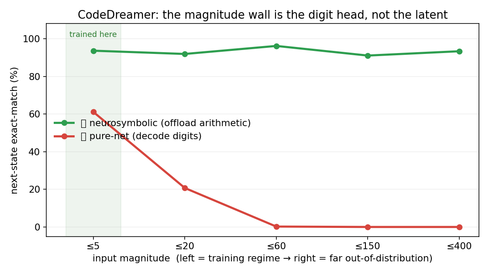

# 🌀 CodeDreamer

### A ~10M-parameter neural net that runs your code *in its head* — and a clean result about why it couldn't do arithmetic.



CodeDreamer learns a **world model of computation**: the "world" is a program
executing, and the model predicts how machine state evolves — in a **learned latent
space**, with every step **anchored to the exact output of a real interpreter**. You
can read its internal state with a linear probe, reach in and edit a register, and
watch its predictions fork. It is, in spirit, *Othello-GPT for a running CPU*.

While building it we hit a wall — the model was great at *control flow* and terrible at
*arithmetic* — and chasing that wall produced the result this repo is really about:

> **The magnitude wall is a design choice, not a capability limit.**
> A model trained only on small numbers fails completely on large ones (whole-state
> exact-match **0.00**). But the failure lives *entirely in the learned digit decoder*.
> Stop asking the net to compute digits — let it predict the *structure* of each step and
> hand the arithmetic to the interpreter's ALU — and the **same frozen weights** jump to
> **0.79 exact-match** at 10–25× out-of-distribution magnitude. Its prediction of *control
> flow* was magnitude-invariant all along (next-pc accuracy **0.99 → 0.99**).

**Execution = (learnable, magnitude-invariant control) + (offloadable arithmetic).**

---

## See it yourself (the slider)

```bash
python -m venv .venv && . .venv/bin/activate
pip install -r demo/requirements.txt
PYTHONPATH=. python demo/app.py          # open the printed local URL
```

Drag the **magnitude slider** to make the program's numbers bigger than anything the
model trained on. The *pure-net* readout (which tries to compute the digits) turns red;
the *neurosymbolic* readout (net predicts structure, ALU fills values) stays green —
on one frozen model. The exact numbers it prints, aggregated over sampled programs:

| input magnitude | 🔴 pure-net exact | 🟢 neurosymbolic exact |
|---|---|---|
| ≈5  (trained here) | 61.9% | 93.3% |
| ≈20 | 26.2% | 91.5% |
| ≈60  (out of distribution) | **0.0%** | 96.2% |
| ≈150 | **0.0%** | 90.8% |
| ≈400  (80× training scale) | **0.0%** | 93.3% |

No GPU needed — the demo runs the included ~10M-param checkpoint on CPU.

---

## The core result (rigorous, n ≈ 10k transitions)

One model, trained only on values ≤ 30 with a codec wide enough to represent big
numbers. Read out two ways on an in-distribution split and a 10–25× magnitude-OOD split:

| split | EM (learned) | EM (arithmetic offloaded) | next-pc acc | branch acc | written-digits |
|---|---|---|---|---|---|
| in-distribution (val ≤ 30) | 0.721 | 0.904 | 0.999 | 0.996 | 0.773 |
| **magnitude-OOD (val 300–800)** | **0.000** | **0.790** | **0.986** | **0.989** | 0.254 |

Read it: whole-state exact-match collapses to **0.000** out of distribution, but with
arithmetic offloaded the *same model* reaches **0.790** — and **control flow barely
moves** (0.999 → 0.986). The only thing that collapses is the digit payload
(0.773 → 0.254): exactly what a symbolic ALU computes for free.

Reproduce: `PYTHONPATH=. python scripts/neurosym_spike.py --steps 1500`
(full method + honest caveats in [`FINDINGS_NEUROSYM.md`](FINDINGS_NEUROSYM.md)).

### …and it runs whole programs

A **neurosymbolic executor** lets the net drive control flow (predict the next pc each
step, including resolving branches) while the ALU computes values:

| split | full-program success | per-step exact | mean exact horizon |
|---|---|---|---|
| in-distribution | 0.70 | 0.873 | 36 steps |
| **magnitude-OOD** | **0.39** | **0.612** | 27.5 steps |

vs a pure-net executor, which is **0.00** at OOD magnitude (it can't survive step one).
Handing the deterministic `pc+1` advance back to the ISA (so the net only decides
branches) lifts OOD full-program success further to **0.55** — see `FINDINGS_FRONTIER.md` §5.
`PYTHONPATH=. python scripts/neurosym_exec_eval.py`

---

## Why this is interesting

- **It reframes a famous failure.** "Neural nets can't do multi-digit arithmetic"
  (Faith-and-Fate, the length-generalization literature) is usually read as a capability
  ceiling. Here it's a *factoring* problem: don't make the net a calculator. Predict the
  dataflow/control and call the ALU. Magnitude generalization then comes for free,
  because magnitude only ever entered through the arithmetic.
- **It sharpens a real moat.** Every prior execution predictor — Learning-to-Execute,
  CodeExecutor, SemCoder, CRUXEval, and Meta's 32B **Code World Model** — predicts traces
  in **token space**, and must emit the digits and eat the arithmetic error. A *latent*
  model can carry an abstract operation and defer the numbers. Nobody had built a grounded
  *latent* world model of execution; this is one, and the factoring is natural in it.
- **It's measurable and interpretable.** Frozen linear probes decode every state field at
  ≥0.99; causal interventions on the latent flip downstream predictions (Othello-GPT
  protocol). The latent really does carry the machine state.

## The honest scorecard

✅ Proven here:
- The magnitude wall is the digit head: OOD exact-match **0.00 → 0.79** by offloading arithmetic, same weights.
- Control flow is invariant to large **outputs**: with multiplication (huge products, modest inputs) next-pc holds **0.999 → 0.998** while the learned digit readout collapses **0.70 → 0.06** — only the offloadable part fails (`FINDINGS_FRONTIER.md` §1). Large **inputs** are the limit: they degrade the *encoder* and nick control (an honest correction to the blanket "control is magnitude-invariant" claim — `FINDINGS_FRONTIER.md` §3).
- The neurosymbolic executor runs whole programs far OOD (0.39 full-success vs 0.00 pure-net).
- On a *learnable* arithmetic slice, the grounded latent beats a matched token-space baseline on whole-state exact-match and on causal counterfactuals; probes + causal edits work.

🔬 Open (the frontier — and the contributor challenge):
- `EM (offloaded)` is **0.79, not 1.0**, and four follow-up experiments
  ([`FINDINGS_FRONTIER.md`](FINDINGS_FRONTIER.md)) localize exactly why. The root cause is
  the **encoder's representation of large *input* operands**: a frozen linear probe shows
  *sign* is a perfectly magnitude-invariant latent direction (1.00 → 1.00) but *order*
  degrades (0.95 → 0.82), and the executor's OOD failures are ~half wrong-pc errors on
  plain arithmetic steps driven by that degraded encoding. **The challenge: a
  magnitude-invariant operand encoding** (e.g. an architectural MSB-first comparator) — and
  a stronger comparison head, which the probe shows leaves recoverable order signal on the
  table.   Magnitude-invariant comparison *cannot be learned from small-magnitude data alone*
  (no signal about large-value order); it needs a prior or a symbolic comparator. We tested
  the simplest *learned* fix — a fixed positional digit encoding — and it does **not** help
  (`FINDINGS_FRONTIER.md` §7), ruling out the learned-re-encoding route. But a **structural
  MSB-first comparator does work**: a learned position-shared digit cell + a fixed
  lexicographic combiner is **perfectly magnitude-invariant** (order accuracy **1.00 → 1.00**
  across a 10–25× shift, vs a plain MLP's 0.75) — `FINDINGS_FRONTIER.md` §8,
  `execwm/model/comparator.py`. So the frontier *is* closable with a learned model; the open
  contributor task is wiring that comparator into the world-model dynamics and measuring the
  end-to-end lift. If you want to push the frontier, this is the place.
- Monolithic multi-digit arithmetic at scale remains unsolved at laptop budget (a clean
  negative for the curriculum approach — `FINDINGS_M3.md` §5). The point of this repo is
  that you may not need to solve it.

## What's in the box

- `ExecWM-Bench` — the first **causal + out-of-distribution** benchmark for code world
  models (counterfactual `do(register)` / `do(replace-instruction)`, the 5 OOD axes,
  frozen-probe interpretability), one command, JSON+markdown report, with a matched
  token-space baseline: `PYTHONPATH=. python scripts/run_execwm_bench.py`.
- A custom DSL → bytecode VM with a per-instruction tracer (free, exact ground truth),
  a lossless state↔tensor codec, and provably-disjoint OOD splits.
- The slotted grounded-latent world model, the neurosymbolic readout + executor, and an
  edit-as-action planner. **111 tests.**

```
execwm/
  substrate/     vm.py (bytecode VM + tracer) · dsl.py · generators.py (5 OOD axes) · edits.py
  data/          state_codec.py · action_codec.py · dataset.py · torch_data.py · edit_codec.py
  model/         world_model.py (slotted latent + grounding heads + JEPA) · edit_dynamics.py · arith.py
  eval/          neurosym.py (the readout breakdown) · neurosym_exec.py (the executor) ·
                 demo_backend.py · probes.py · counterfactual.py · ood_eval.py · execwm_bench.py
  train/         train_m1.py · train_edit.py · curriculum.py
  plan/          goal_tasks.py · planner.py · divergence_planner.py   (edit-as-action planning)
demo/            app.py (the magnitude-slider demo) · requirements.txt
scripts/         neurosym_spike.py · neurosym_exec_eval.py · neurosym_mul.py ·
                 analysis_order_probe.py · analysis_divergence_cause.py · analysis_ood_axes.py
docs/            ARCHITECTURE.md · finding_*.md (the three frontier analyses)
FINDINGS_*.md    NEUROSYM (the headline) · FRONTIER (what's learnable, the synthesis) · M1–M3 (history)
artifacts/       neurosym_model.pt  (the trained checkpoint the demo loads)
```

## The five OOD axes

| Axis | Train | Test |
|---|---|---|
| numeric magnitude | small values | large values |
| trace length | ≤ 32 steps | ≥ 64 steps |
| nesting depth | ≤ 2 | ≥ 4 |
| program size | small | large |
| compositional | held-out operator/context pairings forbidden | those pairings present |

Splits are disjoint by construction (numeric-gap assertion or structural inverse).

## Quick start

```bash
python -m pytest -q                                  # 111 tests
PYTHONPATH=. python scripts/neurosym_spike.py        # the headline result
PYTHONPATH=. python demo/app.py                      # the interactive demo
```

## Background & honest history

CodeDreamer grew out of a research moonshot (full thesis and milestone log in
`PROJECT_OVERVIEW.md`, `FINDINGS_M1.md`…`FINDINGS_M3.md`, and `FINDINGS_NEUROSYM.md`).
Everything is graded against the real interpreter — ground truth is always one VM run
away — and negative results are reported as such.

## License

MIT (see `LICENSE`).
